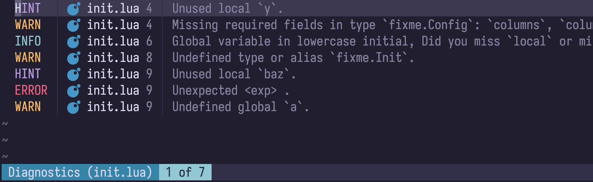

# fixme.nvim

A Neovim plugin designed to enhance the quickfix list experience by providing customizable formatting options for quickfix items.



## Features

- Customizable column formatting for quickfix items.
- Support for cell and column separators.
- Highlighting capabilities for formatted quickfix items.
- Easy integration with Neovim's quickfix functionality.

## Installation

To install `fixme.nvim`, you can use your preferred plugin manager. For example, using `lazy.nvim`:

```lua
return {
    "steschwa/fixme.nvim",
    opts = {
        -- see below for the full configuration reference
    }
}
```

## Configuration

The plugin allows for extensive customization of how each quickfix item is displayed.
You can define your own provider functions that dictate what information to show and how to format it.

<details>
<summary>Types</summary>

```lua
---@alias fixme.ColumnsFn fun(qf_id: number): fixme.Column[]

---@alias fixme.Column fixme.CellFormatter[]
---@alias fixme.CellFormatter fun(qf_item: fixme.QuickfixItem): fixme.FormatResult

---@class fixme.FormatResult
---@field text string
---@field hl string?

---@class fixme.QuickfixItem
---@field bufnr number
---@field lnum number
---@field end_lnum number
---@field col number
---@field end_col number
---@field text string
---@field type string
---@field valid number
```

</details>

<details>
<summary>Default Configuration</summary>

These values are used by default if not overridden by you.

```lua
{
    columns = function() return {} end,
    cell_separator = " ",
    column_separator = "|",
}
```

</details>

### Example Configuration

Here’s an example that demonstrates how to set up `fixme.nvim` with custom columns and separators:

```lua
local function cell_severity(item)
    local severity = vim.diagnostic.severity[item.type]
    if not severity then
        return { text = "" }
    end

    local severity_name = vim.diagnostic.severity[severity]
    if type(severity_name) ~= "string" or severity_name == "" then
        return { text = "" }
    end

    local hl = ({
        [vim.diagnostic.severity.ERROR] = "DiagnosticError",
        [vim.diagnostic.severity.WARN] = "DiagnosticWarn",
        [vim.diagnostic.severity.INFO] = "DiagnosticInfo",
        [vim.diagnostic.severity.HINT] = "DiagnosticHint",
    })[severity]

    return {
        text = severity_name:upper(),
        hl = hl,
    }
end

local function cell_lnum(item)
    local lnum = item.lnum or item.end_lnum

    return {
        text = tostring(lnum),
        hl = "Comment",
    }
end

local function cell_filename(item)
    local path = vim.fn.bufname(item.bufnr)
    local filename = vim.fn.fnamemodify(path, ":t")

    return {
        text = filename,
        hl = "FixmeFilepath",
    }
end

local function cell_file_icon(item)
    local path = vim.fn.bufname(item.bufnr)
    local filename = vim.fn.fnamemodify(path, ":t")
    local extension = vim.fn.fnamemodify(path, ":e")

    local icon, hl = require("nvim-web-devicons").get_icon(filename, extension)
    if icon ~= nil then
        icon = string.format("%s ", icon)
    end

    return {
        text = icon or " ",
        hl = hl or "Comment",
    }
end

local function cell_text(item)
    return {
        text = vim.trim(item.text),
        hl = "FixmeText",
    }
end

local COLUMNS_DIAGNOSTICS = {
    { cell_severity },
    { cell_file_icon, cell_filename, cell_lnum },
    { cell_text },
}
local COLUMNS_NORMAL = {
    { cell_file_icon, cell_filename, cell_lnum },
    { cell_text },
}

return {
    dir = "steschwa/fixme.nvim",
    opts = {
        columns = function(qf_id)
            local context = vim.fn.getqflist({ id = qf_id, context = true, }).context

            if context == "diagnostics" then
                return COLUMNS_DIAGNOSTICS
            end

            return COLUMNS_NORMAL
        end,
        column_separator = " │ ",
        cell_separator = " ",
    },
}
```

This produces the output of the above screenshot.

> [!NOTE]  
> This plugin does not define any highlight groups by itself.  
> Make sure you create them on demand:
>
> ```lua
> vim.api.nvim_set_hl(0, "FixmeText", { link = "Label" })
> ```

## Contributing

Contributions are welcome! Please feel free to submit a pull request or open an issue for any bugs or feature requests.

## License

This project is licensed under the MIT License. See the [LICENSE](LICENSE) file for details.
